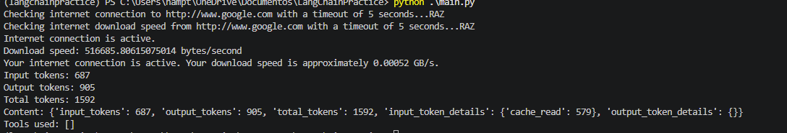
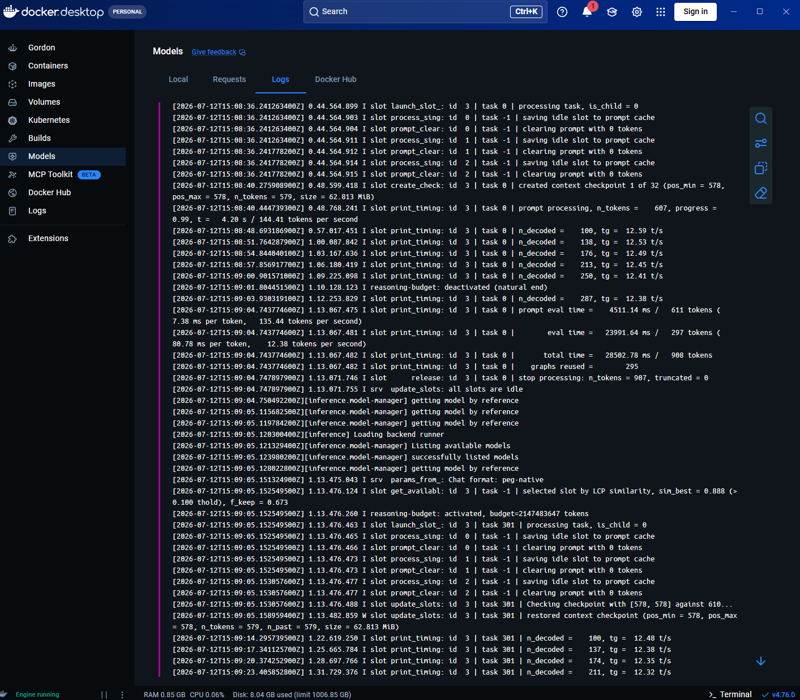

# LangChain Practice

A small Python project for learning how to build a LangChain agent that uses local tools. The current agent can check whether an internet connection is available and estimate download speed.

The project uses a local Qwen model served through Docker Model Runner's OpenAI-compatible endpoint, so no OpenAI API key is required for the current setup.

## What it does

When you run `main.py`, the agent receives a plain-language request, decides whether to call the available tools, and returns a concise answer. The example request asks it to check the connection and download speed.

Available tools:

- `check_internet_connection` — makes a request to confirm that a URL can be reached.
- `check_internet_download_speed` — downloads the response from a URL and calculates an approximate transfer rate in bytes per second.

> The speed result is only a rough estimate: it measures a small response from Google, not a dedicated bandwidth test.

## Requirements

- Python 3.14 or later
- [uv](https://docs.astral.sh/uv/) for dependency management
- Docker Desktop with Docker Model Runner available
- The local model `docker.io/ai/qwen3.6:latest`
- An internet connection for the example tools

## Setup

Clone the repository and install its Python dependencies:

```powershell
uv sync
```

Ensure Docker Model Runner is running and exposes its OpenAI-compatible API at:

```text
http://localhost:12434/v1
```

The configured model is defined in `main.py`:

```python
model_name="docker.io/ai/qwen3.6:latest"
```

If you use a different local model, update that value to its installed model name.

## Run the agent

```powershell
uv run python .\main.py
```

Or, if the virtual environment is already active:

```powershell
python .\main.py
```

Edit `my_question` in `main.py` to ask the agent something different.

## Project structure

```text
.
├── main.py                 # Configures the local model and LangChain agent
├── tools.py                # Internet connection and speed-check tools
├── pyproject.toml          # Project metadata and dependencies
├── uv.lock                 # Locked Python dependency versions
├── OPSPILOT_AI_ROADMAP.md  # Longer-term portfolio project roadmap
└── screenshots/            # Images used by this README
```

## Screenshots

Add your screenshots to the `screenshots` folder, then replace the files below with your own images.

### Agent running in the terminal



### Model running on Docker



### Future chat interface


## Roadmap

This repository also contains an early roadmap for **OpsPilot AI**, a future infrastructure-operations agent project. The roadmap proposes a TypeScript-based agent, simulated incident workflows, approval controls, a dashboard, and audit reporting. See [OPSPILOT_AI_ROADMAP.md](OPSPILOT_AI_ROADMAP.md) for the complete plan.

Potential next steps for this learning project:

- Add MCP tools using `langchain-mcp-adapters`.
- Add a chat UI, such as a C# WPF client.
- Expose the Python agent through a local API for the chat UI.
- Replace the basic speed check with a more reliable test source.

## License

No license has been selected yet.
